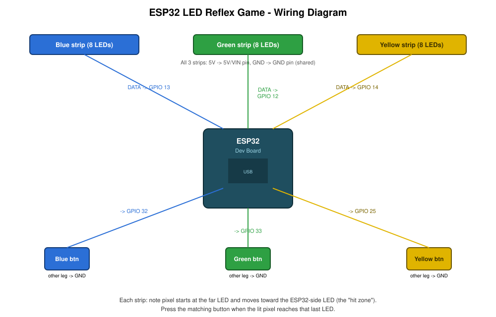

# ESP32 LED Reflex Game

Copyright 2026 @nefariousjosiah

A 3 lane reflex game built on an ESP32 running MicroPython. A colored note starts at the far end of each lane and travels toward the board. Press the matching button when it reaches the last LED to score a hit.



## How it works

Three WS2812B LED strips, one per lane (blue, green, yellow), each with 8 addressable LEDs. A note is a single lit pixel that moves one LED at a time toward the ESP32 side of the strip, which acts as the hit zone. When a note reaches the hit zone, the player has about 0.4 seconds to press that lane's button. A correct press flashes the LED white and increases the score. Missing the window counts as a miss. Score, hits, and misses print live over the serial connection while the board is plugged into a computer.

## Hardware

One ESP32 dev board, any generic ESP32 DevKit. Three WS2812B LED strips with 8 LEDs each, sold as pre wired "stick" modules with data, 5V, and GND pads so no soldering is required. Three tactile push buttons. A breadboard and jumper wires. A USB cable for power and programming. Total cost is roughly $25 to $30.

Pin layout: blue strip data on GPIO 13, green strip data on GPIO 12, yellow strip data on GPIO 14, all three strips sharing 5V and GND. Blue button on GPIO 32, green button on GPIO 33, yellow button on GPIO 25, each with its other leg wired to GND. Full details are in the wiring diagram above.

Note that GPIO12 is a strapping pin that affects boot voltage on some ESP32 boards. It should be fine here since the LED strip only drives that pin after boot, but if a board fails to boot after wiring, move the green strip's data wire to GPIO27 and update `STRIP_PINS["green"]` in `config.py` to match.

## Why MicroPython

This runs on MicroPython instead of Arduino C++, so the code is plain Python running directly on the board. The only extra setup step compared to Arduino is a one time firmware flash, done once with esptool, after which files are just edited and uploaded like any other Python project.

## Project structure

`main.py` is the entry point uploaded to the board as `main.py` so it runs automatically on boot. `config.py` holds pin assignments and tuning constants like timing and brightness. `lane.py` defines the `Lane` class, which owns one LED strip and one button and tracks the state of its active note. `game.py` defines the `Game` class, which spawns notes across lanes and runs the main loop.

## Setup

Install Python from python.org, then install esptool with `pip install esptool`. Install Thonny from thonny.org for an editor with built in ESP32 support.

Download the MicroPython firmware for ESP32 from micropython.org/download/ESP32_GENERIC/, then erase and flash the board, adjusting the port for your system:

```
esptool.py --chip esp32 --port COM3 erase_flash
esptool.py --chip esp32 --port COM3 --baud 460800 write_flash 0x1000 esp32_firmware.bin
```

If flashing fails partway through, retry without `--baud 460800`.

Open Thonny, select "MicroPython (ESP32)" as the interpreter, and pick the correct port. Then upload all four project files (`main.py`, `config.py`, `lane.py`, `game.py`) to the board's root using File, "Save copy," and the MicroPython device option. Reset the board to start the game, and keep Thonny's shell open to see the score.

## License

MIT, see LICENSE.
